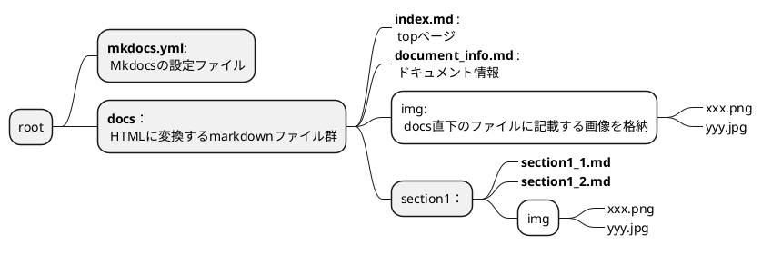
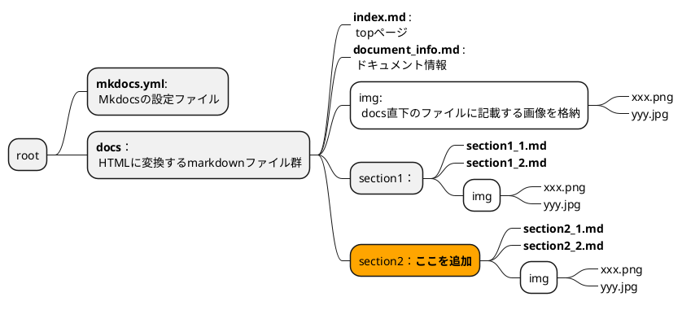
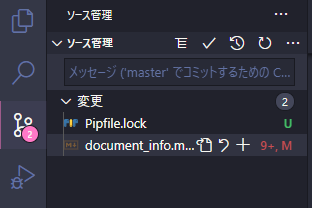
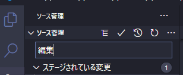
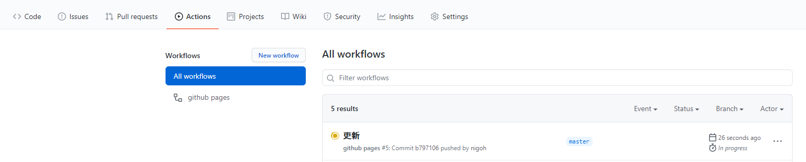
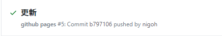

# Mkdocsについて

このドキュメントはpythonのライブラリのmkdocsを使用して制作しています。
## サイト

- [mkdocs.org](https://www.mkdocs.org).
- テーマ [Material for MkDocs](https://squidfunk.github.io/mkdocs-material/)
- 拡張機能 [PyMdown](https://facelessuser.github.io/pymdown-extensions/)

## このドキュメントの編集方法について

!!! note "前提条件"
    ドキュメントを編集するには、python3とgitが必要です。

    - `git --version` - git version2 以上
    - `python --version` - Python 3.8.6以上

    --- 

    インストール方法は以下のサイトを参照ください  

    - [Python公式サイト](https://www.python.org/).  
    - [Git公式サイト](https://git-scm.com/).  

!!! note "Pythonの仮想環境を構築"

    Pythonの仮想環境があるとグローバルのPython環境を汚さずに依存関係を管理できます。  
    virtualenvとPipenvのいずれかのインストールで仮想環境が構築できます。

    --- 

    **virtualenvでの環境構築**

    === "Windows10"
        * `pip install virtualenv` - windows install
        * `virtualenv .env` - 仮想環境作成 rootディレクトり内でコマンド入力
        * `source .env/bin/activate` - 仮想環境の有効化
    === "Linux(Ubuntu)"
        * `sudo apt install virtualenv` - ubuntu(Linux) install 
        * `virtualenv .env` - 仮想環境作成 rootディレクトり内でコマンド入力
        * `source .env/bin/activate` - 仮想環境の有効化

    --- 

    **Pipenvでの環境構築**

    === "Windows10"
        - `pip install pipenv` - pipenvのインストール
        - `pipenv --python 3` - Python3の仮想環境を構築
        - `pipenv install ` - Pipfileにあるパッケージをインストール
        - `.venv\Scripts\activate.bat` - 仮想環境の有効化

    === "Linux(Ubuntu)"
        - `sudo apt install pipenv` - pipenvのインストール
        - `pipenv --python 3` - Python3の仮想環境を構築
        - `pipenv install ` - Pipfileにあるパッケージをインストール
        - `pipenv shell` - 仮想環境の有効化

    --- 

    > virtualenv_参考資料  
    >
    > - 公式サイト https://virtualenv.pypa.io/en/latest/
    >
    > pipenv_参考資料  
    >
    > - 公式repository https://github.com/pypa/pipenv
    > - https://qiita.com/y-tsutsu/items/54c10e0b2c6b565c887a

!!! note "Mkdocsサーバー起動"

    1. repositoryのクローン
        - HTTPS ⇒ `git clone https://github.com/create-webapp-menbers/webappdocs.github.io.git`
        - SSH ⇒ `git clone git@github.com:create-webapp-menbers/webappdocs.github.io.git`

    2. サーバー起動
        ```
        mkdocs serve
        ```
        以下出力
        ```bash
        INFO    -  Building documentation... 
        INFO    -  Cleaning site directory 
        INFO    -  Documentation built in 0.22 seconds 
        [I 201126 22:58:35 server:296] Serving on http://127.0.0.1:8000
        INFO    -  Serving on http://127.0.0.1:8000
        [I 201126 22:58:35 handlers:62] Start watching changes
        INFO    -  Start watching changes
        [I 201126 22:58:35 handlers:64] Start detecting changes
        INFO    -  Start detecting changes
        ```
    3. `http://127.0.0.1:8000`にアクセス
### Mkdocsのファイル構成



- 各sectionのmkdocs.ymlの設定  
上記の構成を以下のように設定することで、各sectionを表示します。

```yml
nav :
  - Home:         index.md
  - DocInfo:      document_info.md
  - section1:
    - section1_1: section1/section1_1.md
    - section1_2: section1/section1_2.md
```

### 例）sectionの追加



- section2をmkdocs.ymlに追加  

```yml
nav :
  - Home:         index.md
  - DocInfo:      document_info.md
  - section1:
    - section1_1: section1/section1_1.md 
    - section1_2: section1/section1_2.md
  - section2:                               # 追記
    - section2_1: section1/section1_1.md    # 追記
    - section2_2: section1/section1_2.md    # 追記
```

## Githubへのプッシュ

プッシュの流れとしては

1. 編集したファイルを仮確定  
編集したファイルを選択して「＋」を押してステージに上げる


2. 編集を確定 コミット  
編集内容を記載して☑を押してコミットする  


1. リモートrepositoryにプッシュ  
画面下のバーにある

⇒のアイコンを押すことでリモートrepositoryにプッシュされる

### プッシュ後の動作について
プッシュ後はGitHubActionで自動的にGitHubPagesに反映されます。

GitHubのrepositoryのAction画面  


☑が表示されれば、デプロイが完了  

