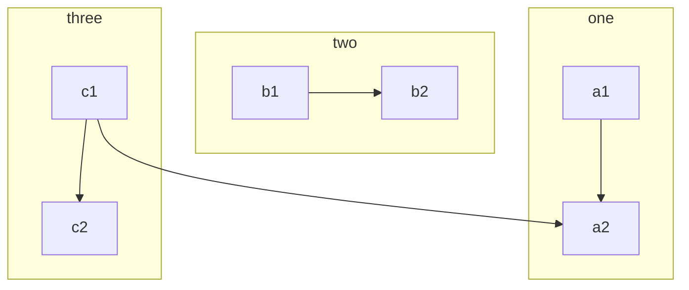
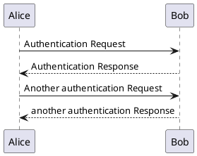

# Mkdocsについて

このドキュメントはpythonのライブラリのmkdocsでできています。

For full documentation visit [mkdocs.org](https://www.mkdocs.org).

## Commands

### Pythonのコマンド一覧

### mkdocsのコマンド一覧
* `mkdocs new [dir-name]` - Create a new project.
* `mkdocs serve` - Start the live-reloading docs server.
* `mkdocs build` - Build the documentation site.
* `mkdocs -h` - Print help message and exit.

## Project layout

    mkdocs.yml    # The configuration file.
    docs/
        index.md  # ドキュメントのホーム.
               # Other markdown pages, images and other files.

- テーマ [Material for MkDocs](https://squidfunk.github.io/mkdocs-material/)

- 拡張機能 [PyMdown](https://facelessuser.github.io/pymdown-extensions/)


## fdsa f
fdsa fds



```{.python .extra-class linenums="1"}
import hello_world
```


