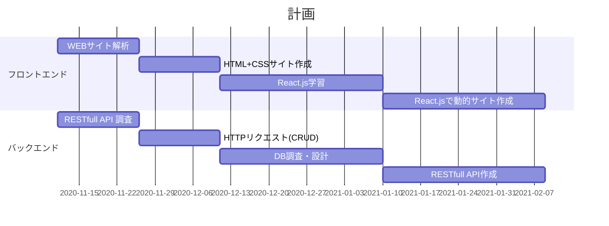

# 交流会ドキュメント

交流会を通じて技術の共有や状況を確認するためのサイトです。

## 目的

---

!!! summary "やりたい事"
    - webアプリケーションを作りたい

    - 構成としては画像のようなシングルページアプリケーション（SPA）を作りたい。

    - 役割を「フロントエンド」「バックエンド」で2分担してそれぞれの作業を数か月単位で交代する
        - やったことの知識や情報は共有する → なるべくクローズなやり取りではなくオープンにやりたい →作ったソースを共有したり、質疑応答をしたりのやり取りはなるべく残したい。

        - どちらも携わることでフルスタックなスキルを身につけたい
s

!!! note "フロントエンドの役割"
    - 前提知識として、普段私たちが見るwebサイトやアプリの画面（見えている部分）はHTML、CSS、JavaScriptで構成されている → サイトなどでF12を押すと確認できる
    - フロントエンドの主な役割は2つ
        -Rest APIとやり取りをして取得して情報をブラウザ上に表示
        - UI、UXの画面周り → ボタンをクリックすると〇〇するとか、画像が自動に動くとかHTMLを操作してクライアントが使いやすい画面を作る
            - Rest APIとやり取りとは、formで入力したデータをAPIに登録、必要情報をAPIから取得する、情報の修正、更新、削除など行う。→ CRUD（create、reference、update、delete） 
    - 上の機能を担うのがReact.jsのフレームワーク
    - フレームワークの特徴は、HTMLファイルをJavaScript言語を使用して動的に書き換える（レンダリング）ことで画面を変化させることができる

!!! note "バックエンドの役割"

    - データ・データソースをフロントエンド側が使いやすいように提供する
    - 使いやすく提供する方法としては、Rest、GraphQLなどがある

## 作業タスク

- ガントチャート

---

=== "フロントエンド計画詳細"

    **【Step1】**

    ---

    WEBサイト解析

    - [ ] 任意のサイトからサイトマップを作る。

    HTML+CSSサイト作成

    - [ ] 作成したサイトマップからHTML＋CSSで静的サイトを作成
        - CSSフレームワークはboostrap4を使用 
    - [ ] 作成したサイトはGitHub Pagesで公開

    **【Step2】**

    ---

    React.js学習

    - [ ] 開発環境構築 node.js
    - [ ] React.jsのtutorialを体験
        - [ ] 作成後はGitHubにリポジトリ登録

    **【Step3】**

    ---

    

    - [ ] HTML+CSSのサイト設計 
        - どこのタグにReact.jsでレンダリングするか考える
    - [ ] コーディング

=== "バックエンド計画詳細"

    **【11月】**

    ---

    RESTfull API 調査

    - [ ] rest apiについてmarkdown形式でドキュメント作成
    - [ ] CRUDを触れてみる
        - postman https://www.postman.com/
        - 上のツールで実際のAPIを扱ってみる
        - 無料APIの参考 https://qiita.com/cnakano/items/ff3fd90f685f4ca363cc
    - [ ] アイシン精機のサイトからrest API化した場合の必要要素を考察
        - [ ] フレーム(枠組み)とエレメント(要素)に分けてみる
        - [ ] スプレッドシートなどで考察資料を残しておく

    **【12月】**

    ---

    DBの設計

    - [ ] 考察資料を元にDBの設計を行う
        - [ ] ER図を書く A5SQLを使う
        - [ ] 環境構築 Python 必要ライブラリインスト

    **【1月】**

    ---

    **Django + Django REST Freamwork**

    - [ ] 設計したER図からmodel、url、viewを書いてみる
    - [ ] Gitリポジトリ登録
    - [ ] REST API化 (Django rest  framework) 計画外

