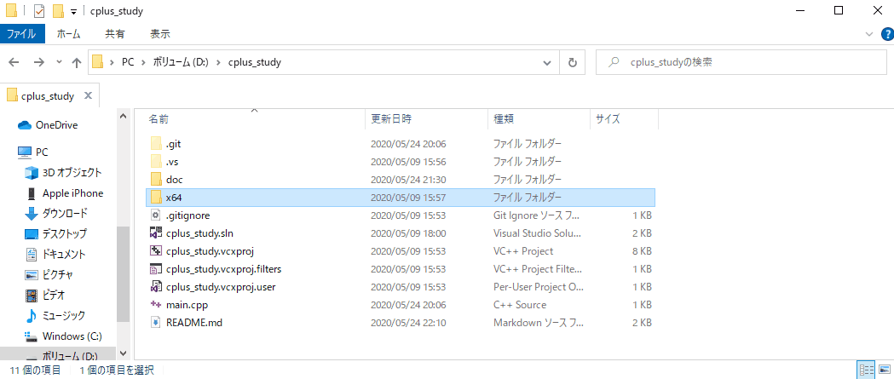
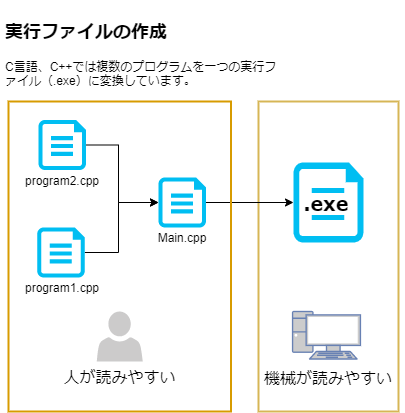
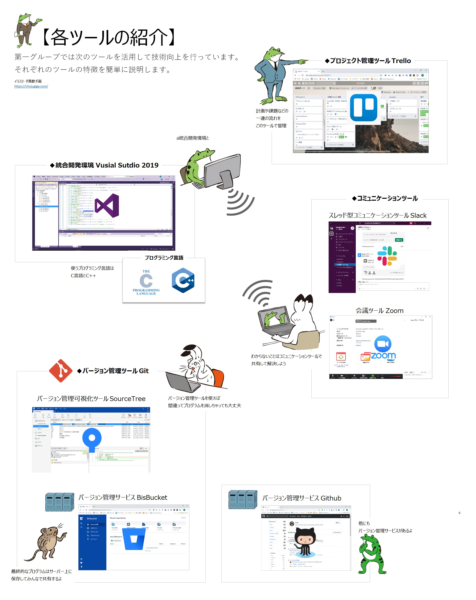

# プログラミング学習の進め方

---

## 事前知識：メイン関数について

### メイン関数はプログラム処理の入口

---

???+ note "メイン関数とは"

    - プログラムを起動する時に、一番最初に処理を行う入口の関数です。
    - メイン関数はプログラムのなかで1つしか使えません。

    ---
        なぜメイン関数が1つしかないかというと、2つメイン関数があるとプログラムを実行するときに、
        どの場所から処理を始めればいいかわからなくなるため1つしかありません。  
        ちなみに出口も1つしかありません。それは後々わかってくるでしょう。  
        
        ※実際にメイン関数を2つ用意してビルド（実行ファイルを作成）するとエラーが出力されます。  
        なので、実際にはそこまで意識しなくても大丈夫です。便利な統合開発環境が何とかしてくれます。  

### メイン関数の読み方

---

以下処理が何もないメイン関数です。関数のことについては、今は何らかの処理を行う箱のようなものと覚えておきましょう。  

```cpp

int main(int argc, char* argv[])
{
    // この場所に書いたプログラムが最初に動きます。
}

```

それではまず、一行目から見ていきましょう。
関数は**何を入れて何を出すをはじめに宣言**する必要があります。

```cpp
int main(int argc, char* argv[])
```

この一行を読むなら、  
「 **main** という名前の関数は、 **int argc** と <b>char* argv[]</b> を入力して、**int** で出力する。」と読めます。もう少し分解して見てみましょう。


???+ note " もう少しメイン関数の読み方"
    ---

     

    ここでは出力については触れてませんが、この出力についても後々わかってくることでしょう。

### メイン関数に処理を書く

---

最後にこのカッコについて説明しましょう。  
カッコ内に書いたプログラムが動きます。

```cpp
{
    // この場所に書いたプログラムが最初に動きます。
}
```

とにかく書いてみましょう。  
たとえば、1～1000のまで標準出力するプログラムを作成してみました。  

```cpp

int main(int argc, char* argv[])
{
    // 1~1000まで標準出力する処理
    fprintf(stdout, "1~1000 printout start \n");

    int limit = 1000;
    for (int i = 0; i < limit; i++)
    {
        fprintf(stdout, "count num = %d\n", i + 1);
    }

    fprintf(stdout, "1~1000 printout end \n");

}

```

実行してみると

```cmd

1
2
3
....
999
1000
```

と表示されるでしょう。  
このように｛｝で囲まれた文字列が実行されます。

実行方法は次の章でお話しましょう。

## 事前知識：実行ファイルについて

---

統合開発環境でビルドした後に、x64\Debugにcplus_study.exeというファイルができているかと思われます。  

.exeという拡張子（ファイルの種類）を実行ファイルと呼びます。  

実行ファイルはその名の通りプログラムを実行するためのファイルです。  

正確に言うと機械が、読みやすいプログラムが実行ファイルです。  
また人間が、読みやすいプログラムをcpp、cなどの拡張子のファイルです。  



実行ファイルはどのように作られているかを説明します。  
以下の図のように、複数のプログラムをまとめて1つの実行ファイルを作成します。  

このように実行ファイルを作成してプログラムを実行する言語のことを**コンパイル言語**と呼びます。  



## _学習方法_

---


課題の処理をメイン関数に作成してコミットして提出するようにします。

## _その他_

---

### ツールの紹介

---


